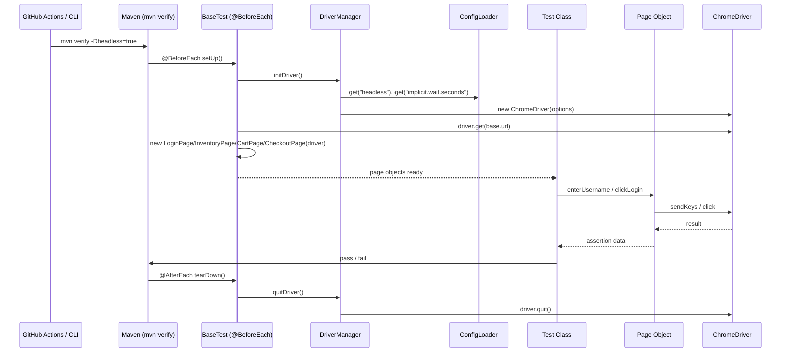
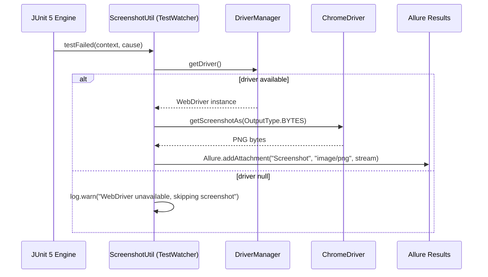
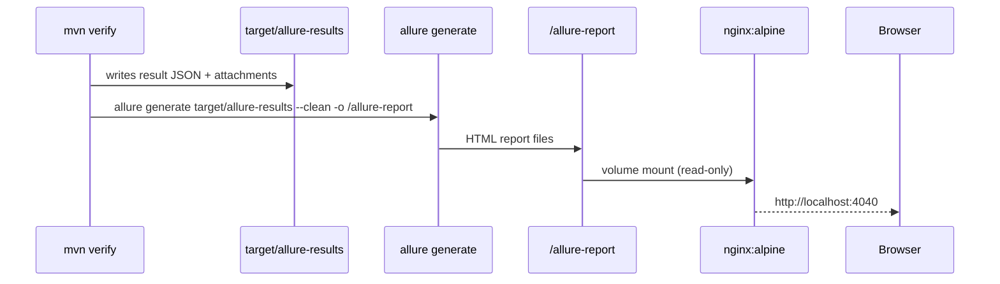
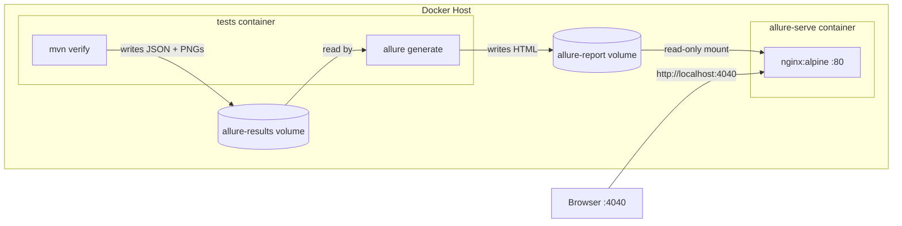

# Design Document: Dockerized Test Automation

## Overview

This document describes the technical design for a fully Dockerized, CI-ready Selenium test automation suite targeting the Swag Labs demo application (https://www.saucedemo.com/). The suite covers Login, Cart, and Checkout UI flows using Java 11+, Maven, JUnit 5, Selenium WebDriver 4, and the Page Object Model (POM) with Page Factory. Tests execute inside a Docker container, produce Allure 2.29 HTML reports with automatic failure screenshots, and are triggered via a GitHub Actions CI pipeline.

### Goals

- Reproducible test execution across developer machines, Docker, and CI
- Structured Allure reports with failure screenshots attached automatically
- Parameterised tests driven by a seeded `TestDataFactory` for deterministic data
- Single `docker compose up` command to run tests and serve the report

### Technology Stack

| Concern | Choice | Version |
|---|---|---|
| Language | Java | 11+ |
| Build | Maven | 3.9.x |
| Test framework | JUnit 5 | 5.10.x |
| Browser automation | Selenium WebDriver | 4.x |
| Driver management | WebDriverManager | 5.x |
| Reporting | Allure | 2.29.0 |
| Test data | Java Faker | 1.0.2 |
| Logging | SLF4J + Logback | 2.x / 1.5.x |
| Container base | selenium/standalone-chrome | latest |
| Report server | nginx | alpine |
| CI | GitHub Actions | — |

---

## Architecture

### High-Level Component Diagram

```mermaid
graph TD
    subgraph Test Execution
        BT[BaseTest]
        SW[ScreenshotUtil\n(TestWatcher Extension)]
        DM[DriverManager\nThreadLocal<WebDriver>]
        CL[ConfigLoader\ntest.properties]
        TDF[TestDataFactory\nJava Faker seed=42]
        SU[SeleniumUtils\nwait utilities]
    end

    subgraph Test Classes
        LT[LoginTest]
        CT[CartTest]
        CHT[CheckoutTest]
    end

    subgraph Page Objects
        LP[LoginPage]
        IP[InventoryPage]
        CP[CartPage]
        CHP[CheckoutPage]
    end

    subgraph Reporting
        AR[Allure Results\ntarget/allure-results]
        AH[Allure HTML Report\ntarget/allure-report]
    end

    LT --> BT
    CT --> BT
    CHT --> BT
    BT --> DM
    BT --> SW
    BT --> LP
    BT --> IP
    BT --> CP
    BT --> CHP
    DM --> CL
    SW --> AR
    LP --> SU
    IP --> SU
    CP --> SU
    CHP --> SU
    LT -.->|@MethodSource| TDF
    CHT -.->|@MethodSource| TDF
    AR --> AH
```

### Package Structure

```
src/
├── main/java/org/example/
│   ├── pages/
│   │   ├── LoginPage.java
│   │   ├── InventoryPage.java
│   │   ├── CartPage.java
│   │   └── CheckoutPage.java
│   └── utils/
│       ├── ConfigLoader.java
│       ├── DriverManager.java
│       ├── ScreenshotUtil.java
│       ├── SeleniumUtils.java
│       └── TestDataFactory.java
└── test/
    ├── java/org/example/
    │   ├── base/
    │   │   └── BaseTest.java
    │   └── tests/
    │       ├── LoginTest.java
    │       ├── CartTest.java
    │       └── CheckoutTest.java
    └── resources/
        └── test.properties
```

---

## Components and Interfaces

### ConfigLoader

Reads `src/test/resources/test.properties` at class-load time. System properties override file values, enabling Docker/CI overrides via `-D` flags.

```java
public class ConfigLoader {
    private static final Properties props = new Properties();

    static { /* load test.properties from classpath */ }

    /** Returns the string value for key, preferring system properties. Throws IllegalStateException if absent. */
    public static String get(String key);

    /** Returns the boolean value for key. */
    public static boolean getBoolean(String key);

    /** Returns the int value for key. */
    public static int getInt(String key);
}
```

**test.properties keys and defaults:**

| Key | Default | Description |
|---|---|---|
| `base.url` | `https://www.saucedemo.com/` | SUT base URL |
| `headless` | `true` | Run Chrome headless |
| `implicit.wait.seconds` | `5` | WebDriver implicit wait |
| `explicit.wait.seconds` | `10` | WebDriverWait max duration |
| `faker.seed` | `42` | Java Faker seed for reproducibility |

---

### DriverManager

Manages the `WebDriver` lifecycle using `ThreadLocal` for thread-safety. Uses WebDriverManager to resolve ChromeDriver automatically.

```java
public class DriverManager {
    private static final ThreadLocal<WebDriver> driver = new ThreadLocal<>();

    /** Initialises a ChromeDriver instance with options from ConfigLoader and stores it in ThreadLocal. */
    public static void initDriver();

    /** Returns the WebDriver for the current thread. */
    public static WebDriver getDriver();

    /** Quits the WebDriver and removes it from ThreadLocal. */
    public static void quitDriver();
}
```

Chrome options applied when `headless=true`: `--headless`, `--no-sandbox`, `--disable-dev-shm-usage`.

---

### SeleniumUtils

Shared wait utilities used by all page objects. Reads explicit wait duration from `ConfigLoader`.

```java
public class SeleniumUtils {
    /**
     * Waits until the given element is visible on the page.
     * Uses explicit wait duration from ConfigLoader.
     */
    public static WebElement waitForVisible(WebDriver driver, By locator);

    /**
     * Waits until the current URL contains the given fragment.
     */
    public static void waitForUrlContains(WebDriver driver, String fragment);

    /**
     * Waits until the given element is clickable and clicks it.
     */
    public static void waitAndClick(WebDriver driver, WebElement element);
}
```

---

### LoginPage

```java
public class LoginPage {
    private final WebDriver driver;

    @FindBy(id = "user-name")       private WebElement usernameField;
    @FindBy(id = "password")        private WebElement passwordField;
    @FindBy(id = "login-button")    private WebElement loginButton;
    @FindBy(css = "[data-test='error']") private WebElement errorMessage;

    public LoginPage(WebDriver driver);  // calls PageFactory.initElements(driver, this)
    public void enterUsername(String username);
    public void enterPassword(String password);
    public void clickLogin();
    public String getErrorMessage();
    public boolean isErrorDisplayed();
}
```

---

### InventoryPage

```java
public class InventoryPage {
    private final WebDriver driver;

    @FindBy(className = "inventory_item")           private List<WebElement> inventoryItems;
    @FindBy(className = "shopping_cart_badge")      private WebElement cartBadge;
    @FindBy(className = "shopping_cart_link")       private WebElement cartLink;

    public InventoryPage(WebDriver driver);  // calls PageFactory.initElements(driver, this)
    public void addItemToCartByIndex(int index);
    public void addAllItemsToCart();
    public int getCartBadgeCount();
    public int getInventoryItemCount();
    public void goToCart();
}
```

---

### CartPage

```java
public class CartPage {
    private final WebDriver driver;

    @FindBy(className = "cart_item")                    private List<WebElement> cartItems;
    @FindBy(className = "shopping_cart_badge")          private WebElement cartBadge;
    @FindBy(id = "checkout")                            private WebElement checkoutButton;

    public CartPage(WebDriver driver);  // calls PageFactory.initElements(driver, this)
    public List<String> getCartItemNames();
    public int getCartItemCount();
    public int getCartBadgeCount();
    public void removeItemByIndex(int index);
    public void proceedToCheckout();
}
```

---

### CheckoutPage

```java
public class CheckoutPage {
    private final WebDriver driver;

    @FindBy(id = "first-name")          private WebElement firstNameField;
    @FindBy(id = "last-name")           private WebElement lastNameField;
    @FindBy(id = "postal-code")         private WebElement postalCodeField;
    @FindBy(id = "continue")            private WebElement continueButton;
    @FindBy(id = "finish")              private WebElement finishButton;
    @FindBy(css = "[data-test='error']")    private WebElement errorMessage;
    @FindBy(className = "complete-header")  private WebElement confirmationHeader;

    public CheckoutPage(WebDriver driver);  // calls PageFactory.initElements(driver, this)
    public void fillCheckoutInfo(String firstName, String lastName, String postalCode);
    public void clickContinue();
    public void clickFinish();
    public String getErrorMessage();
    public boolean isErrorDisplayed();
    public String getConfirmationMessage();
}
```

---

### ScreenshotUtil

Implements `TestWatcher` (JUnit 5 extension) to auto-capture screenshots on failure and attach them to Allure.

```java
public class ScreenshotUtil implements TestWatcher {

    /**
     * Called by JUnit 5 when a test fails. Captures the current browser viewport as PNG
     * and attaches it to the Allure report via Allure.addAttachment.
     * If the WebDriver is unavailable, logs a warning and returns without throwing.
     */
    @Override
    public void testFailed(ExtensionContext context, Throwable cause);

    /** Captures screenshot bytes from the current WebDriver instance. */
    private byte[] captureScreenshot();
}
```

---

### BaseTest

Registers `ScreenshotUtil` as a JUnit 5 extension, manages driver lifecycle, and instantiates all page objects for use by test subclasses.

```java
@ExtendWith(ScreenshotUtil.class)
public abstract class BaseTest {

    protected LoginPage loginPage;
    protected InventoryPage inventoryPage;
    protected CartPage cartPage;
    protected CheckoutPage checkoutPage;

    @BeforeEach
    void setUp() {
        DriverManager.initDriver();
        WebDriver driver = DriverManager.getDriver();
        driver.get(ConfigLoader.get("base.url"));
        loginPage     = new LoginPage(driver);
        inventoryPage = new InventoryPage(driver);
        cartPage      = new CartPage(driver);
        checkoutPage  = new CheckoutPage(driver);
    }

    @AfterEach
    void tearDown() {
        DriverManager.quitDriver();
    }
}
```

---

### TestDataFactory

Centralised test data generator using Java Faker with a fixed seed for reproducibility.

```java
public class TestDataFactory {
    private static final long SEED = ConfigLoader.getInt("faker.seed"); // default 42
    private static final Faker faker = new Faker(new Random(SEED));

    /** Returns a CheckoutInfo record with faker-generated first name, last name, postal code. */
    public static CheckoutInfo validCheckoutInfo();

    /** Returns a Stream<Arguments> of {username, password} pairs for invalid login tests. */
    public static Stream<Arguments> invalidCredentials();

    /** Returns a Stream<Arguments> of {firstName, lastName, postalCode} for invalid checkout form tests. */
    public static Stream<Arguments> invalidCheckoutData();

    // Edge-case string helpers
    public static String emptyString();
    public static String whitespaceOnly();
    public static String longString(int length);   // length > 255
    public static String specialChars();
    public static String unicodeEmoji();
}

public record CheckoutInfo(String firstName, String lastName, String postalCode) {}
```

**Seed mechanism:** `faker.seed` is read from `test.properties` (default `42`). The same seed always produces the same sequence of generated values, so a CI failure is reproducible locally without any extra configuration.

---

## Data Models

### CheckoutInfo Record

```java
public record CheckoutInfo(String firstName, String lastName, String postalCode) {}
```

### Test Configuration (test.properties)

```properties
base.url=https://www.saucedemo.com/
headless=true
implicit.wait.seconds=5
explicit.wait.seconds=10
faker.seed=42
```

### pom.xml Dependency List

```xml
<!-- JUnit 5 -->
<dependency>
    <groupId>org.junit.jupiter</groupId>
    <artifactId>junit-jupiter</artifactId>
    <version>5.10.2</version>
    <scope>test</scope>
</dependency>

<!-- Selenium WebDriver 4 -->
<dependency>
    <groupId>org.seleniumhq.selenium</groupId>
    <artifactId>selenium-java</artifactId>
    <version>4.20.0</version>
</dependency>

<!-- WebDriverManager -->
<dependency>
    <groupId>io.github.bonigarcia</groupId>
    <artifactId>webdrivermanager</artifactId>
    <version>5.8.0</version>
</dependency>

<!-- Allure JUnit 5 integration -->
<dependency>
    <groupId>io.qameta.allure</groupId>
    <artifactId>allure-junit5</artifactId>
    <version>2.29.0</version>
</dependency>

<!-- Java Faker -->
<dependency>
    <groupId>com.github.javafaker</groupId>
    <artifactId>javafaker</artifactId>
    <version>1.0.2</version>
</dependency>

<!-- SLF4J API -->
<dependency>
    <groupId>org.slf4j</groupId>
    <artifactId>slf4j-api</artifactId>
    <version>2.0.13</version>
</dependency>

<!-- Logback (SLF4J implementation) -->
<dependency>
    <groupId>ch.qos.logback</groupId>
    <artifactId>logback-classic</artifactId>
    <version>1.5.6</version>
</dependency>
```

Maven plugins required:

```xml
<!-- maven-surefire-plugin 3.x for JUnit 5 -->
<plugin>
    <groupId>org.apache.maven.plugins</groupId>
    <artifactId>maven-surefire-plugin</artifactId>
    <version>3.2.5</version>
    <configuration>
        <argLine>-javaagent:${settings.localRepository}/org/aspectj/aspectjweaver/${aspectj.version}/aspectjweaver-${aspectj.version}.jar</argLine>
    </configuration>
</plugin>

<!-- allure-maven plugin -->
<plugin>
    <groupId>io.qameta.allure</groupId>
    <artifactId>allure-maven</artifactId>
    <version>2.12.0</version>
    <configuration>
        <reportVersion>2.29.0</reportVersion>
    </configuration>
</plugin>
```

---

## Data Flow

### Test Execution Flow



### Screenshot Capture Flow



### Report Generation Flow



---

## Docker Architecture

### Dockerfile Design

```dockerfile
FROM selenium/standalone-chrome:latest
USER root

# Install Maven, wget, tar
RUN apt-get update && apt-get install -y maven wget tar && rm -rf /var/lib/apt/lists/*

# Install Allure CLI 2.29.0
RUN wget -q https://github.com/allure-framework/allure2/releases/download/2.29.0/allure-2.29.0.tgz \
    && tar -xzf allure-2.29.0.tgz -C /opt \
    && ln -s /opt/allure-2.29.0/bin/allure /usr/local/bin/allure \
    && rm allure-2.29.0.tgz

WORKDIR /app
COPY . .

# Pre-cache Maven dependencies
RUN mvn dependency:resolve -q

CMD ["sh", "-c", "mvn verify -Dheadless=true && allure generate target/allure-results --clean -o /allure-report"]
```

### docker-compose.yml Design

```yaml
version: "3.8"

services:
  tests:
    build: .
    container_name: selenide-tests
    volumes:
      - allure-results:/app/target/allure-results
      - allure-report:/allure-report

  allure-serve:
    image: nginx:alpine
    container_name: allure-serve
    depends_on:
      tests:
        condition: service_completed_successfully
    ports:
      - "4040:80"
    volumes:
      - allure-report:/usr/share/nginx/html:ro

volumes:
  allure-results:
  allure-report:
```

### Container Interaction Diagram



---

## CI Pipeline

### GitHub Actions Workflow

**File:** `.github/workflows/ci.yml`

```yaml
name: Dockerized Test Automation

on:
  push:
    branches: [main]
  pull_request:
    branches: [main]

jobs:
  test:
    runs-on: ubuntu-latest
    steps:
      - name: Checkout source
        uses: actions/checkout@v4

      - name: Build Docker image
        run: docker build -t dockerized-test-automation .

      - name: Run tests via Docker Compose
        run: docker compose up --exit-code-from tests

      - name: Upload allure-results artifact
        if: always()
        uses: actions/upload-artifact@v4
        with:
          name: allure-results
          path: target/allure-results

      - name: Upload allure-report artifact
        if: always()
        uses: actions/upload-artifact@v4
        with:
          name: allure-report
          path: allure-report
```

**Pipeline Steps:**

1. Trigger on push/PR to `main`
2. Checkout repository
3. `docker build` — builds the image, installs Maven + Allure CLI, pre-caches dependencies
4. `docker compose up --exit-code-from tests` — runs the `tests` service; exit code propagates to CI
5. Upload `allure-results` artifact (always, even on failure)
6. Upload `allure-report` artifact (always, even on failure)

---

## Correctness Properties

*A property is a characteristic or behavior that should hold true across all valid executions of a system — essentially, a formal statement about what the system should do. Properties serve as the bridge between human-readable specifications and machine-verifiable correctness guarantees.*

### Property 1: ConfigLoader file read round-trip

*For any* key present in `test.properties`, `ConfigLoader.get(key)` should return the exact value stored in the file when no system property with that key is set.

**Validates: Requirements 2.1, 2.2, 2.3, 2.4, 2.5**

---

### Property 2: ConfigLoader missing key throws exception

*For any* key that is absent from both `test.properties` and the JVM system properties, calling `ConfigLoader.get(key)` should throw an `IllegalStateException` whose message contains the missing key name.

**Validates: Requirements 2.6**

---

### Property 3: ConfigLoader system property override

*For any* key present in `test.properties`, if a JVM system property with the same key is set to a different value, `ConfigLoader.get(key)` should return the system property value rather than the file value.

**Validates: Requirements 2.7**

---

### Property 4: DriverManager headless Chrome options

*For any* invocation of `DriverManager.initDriver()` when `headless=true` is configured, the `ChromeOptions` passed to the driver should contain all three required arguments: `--headless`, `--no-sandbox`, and `--disable-dev-shm-usage`.

**Validates: Requirements 3.2**

---

### Property 5: DriverManager ThreadLocal isolation

*For any* two concurrent threads that each call `DriverManager.initDriver()`, the `WebDriver` instance returned by `DriverManager.getDriver()` on each thread should be a distinct object, ensuring no shared state between threads.

**Validates: Requirements 3.5**

---

### Property 6: Invalid login credentials always produce an error message

*For any* combination of username and password that does not match a valid Swag Labs account (including wrong credentials, SQL injection strings, XSS strings, strings exceeding 255 characters, whitespace-only values, and empty fields), submitting the login form should result in an error message being displayed on the login page and the inventory page URL should not be loaded.

**Validates: Requirements 5.2, 5.3, 5.4**

---

### Property 7: Screenshot captured and attached on test failure

*For any* test that fails while a `WebDriver` instance is available, `ScreenshotUtil.testFailed()` should capture a non-empty PNG byte array from the browser and attach it to the Allure report as an attachment named "Screenshot" with MIME type `image/png`.

**Validates: Requirements 8.1, 8.2, 5.5, 6.5, 7.5**

---

### Property 8: Screenshot capture is safe when driver is unavailable

*For any* invocation of `ScreenshotUtil.testFailed()` when `DriverManager.getDriver()` returns `null`, the method should complete without throwing any exception and should log a warning message.

**Validates: Requirements 8.4**

---

### Property 9: Cart badge count equals number of distinct items added

*For any* sequence of add-to-cart operations on distinct products, the cart badge count displayed on the inventory page should equal the total number of distinct products added. Adding the same product a second time should not increment the badge beyond 1 for that product (idempotence of add for a single product).

**Validates: Requirements 6.1, 6.4, 6.7**

---

### Property 10: Cart page lists all added items

*For any* set of products added to the cart from the inventory page, navigating to the cart page should display a list whose item names are exactly the set of added product names — no more, no fewer.

**Validates: Requirements 6.2**

---

### Property 11: Cart item removal decrements badge and removes item from list

*For any* item currently present in the cart, removing it should decrement the cart badge count by exactly 1 and the item should no longer appear in the cart item list.

**Validates: Requirements 6.3**

---

### Property 12: Invalid checkout form submission always produces a validation error

*For any* checkout form submission where at least one required field (first name, last name, or postal code) is empty, whitespace-only, contains only special characters, or exceeds the maximum allowed length, the system should display a validation error message and should not advance to the order summary page.

**Validates: Requirements 7.3, 7.4, 7.6**

---

### Property 13: TestDataFactory seed reproducibility

*For any* fixed seed value, calling `TestDataFactory.invalidCredentials()` or `TestDataFactory.validCheckoutInfo()` multiple times with the same seed should produce identical outputs on every invocation, regardless of the execution environment (local or CI).

**Validates: Requirements 5.7, 13.1, 13.6**

---

## Error Handling

### ConfigLoader

- Missing property key → `IllegalStateException("Missing required property: <key>")`
- Malformed integer property → `NumberFormatException` propagated with context message
- `test.properties` file not found on classpath → `IllegalStateException` at class load time

### DriverManager

- `WebDriverManager.chromedriver().setup()` failure → exception propagates; test is marked as failed by JUnit 5
- `driver.quit()` in `quitDriver()` is wrapped in try-catch to prevent teardown failures from masking test failures; exceptions are logged at WARN level

### ScreenshotUtil

- `DriverManager.getDriver()` returns `null` → log warning, return without attaching; no exception thrown
- `TakesScreenshot.getScreenshotAs()` throws → log warning with stack trace, return without attaching

### Page Objects

- `StaleElementReferenceException` → callers should use `SeleniumUtils.waitForVisible()` or `SeleniumUtils.waitAndClick()`; page objects do not silently retry
- `NoSuchElementException` → propagates to test; test fails with a clear message

### Docker / CI

- `mvn verify` non-zero exit → Docker CMD exits non-zero → `docker compose up --exit-code-from tests` exits non-zero → GitHub Actions step fails
- `allure generate` failure → logged to stderr; Docker CMD exits non-zero

---

## Testing Strategy

### Dual Testing Approach

Both unit tests and property-based tests are required. They are complementary:

- Unit tests verify specific examples, integration points, and edge cases
- Property-based tests verify universal correctness across many generated inputs

### Unit Tests

Focus areas:

- `ConfigLoader`: verify each property key returns the correct value; verify `IllegalStateException` on missing key; verify system property override with a specific key/value pair
- `DriverManager`: verify `getDriver()` returns non-null after `initDriver()`; verify `getDriver()` returns null after `quitDriver()`
- `TestDataFactory`: verify `validCheckoutInfo()` returns a non-null record with non-blank fields; verify `invalidCredentials()` stream is non-empty; verify edge-case string helpers return expected characteristics (empty, whitespace, length > 255, etc.)
- `ScreenshotUtil`: verify no exception when driver is null (mock `DriverManager.getDriver()` to return null)
- `SeleniumUtils`: verify `waitForVisible` returns element when visible; verify `waitForUrlContains` completes when URL matches
- Page Object construction: verify `@FindBy` fields are non-null after `PageFactory.initElements` (requires a live or mocked driver)

Avoid duplicating coverage that property tests already provide. Unit tests should focus on concrete examples and integration seams.

### Property-Based Tests

**Library:** [jqwik](https://jqwik.net/) (JUnit 5 native property-based testing for Java)

**Configuration:** Each property test must run a minimum of **100 tries** (`@Property(tries = 100)`).

**Tag format for each test:**
```java
// Feature: dockerized-test-automation, Property <N>: <property_text>
```

Each correctness property from the design document must be implemented by exactly one property-based test:

| Property | Test class | Generator strategy |
|---|---|---|
| P1: ConfigLoader file read round-trip | `ConfigLoaderPropertyTest` | Generate arbitrary key/value pairs, write to temp properties file, verify round-trip |
| P2: ConfigLoader missing key throws | `ConfigLoaderPropertyTest` | Generate arbitrary keys not present in file, verify exception |
| P3: ConfigLoader system property override | `ConfigLoaderPropertyTest` | Generate key + two different values, set system property, verify override |
| P4: DriverManager headless options | `DriverManagerPropertyTest` | Generate headless=true config, capture ChromeOptions, verify args present |
| P5: DriverManager ThreadLocal isolation | `DriverManagerPropertyTest` | Spawn N threads, each calls initDriver(), verify distinct instances |
| P6: Invalid login credentials show error | `LoginPropertyTest` | Generate invalid credential pairs from TestDataFactory stream |
| P7: Screenshot captured on failure | `ScreenshotUtilPropertyTest` | Mock WebDriver returning random PNG bytes, verify attachment |
| P8: Screenshot safe when driver null | `ScreenshotUtilPropertyTest` | Call testFailed() with null driver, verify no exception |
| P9: Cart badge equals items added | `CartPropertyTest` | Generate random item counts 1..max, add items, verify badge |
| P10: Cart lists all added items | `CartPropertyTest` | Generate random item subsets, add, navigate to cart, verify names |
| P11: Cart removal decrements badge | `CartPropertyTest` | Add N items, remove one, verify badge N-1 and item absent |
| P12: Invalid checkout form shows error | `CheckoutPropertyTest` | Generate invalid form data from TestDataFactory stream |
| P13: TestDataFactory seed reproducibility | `TestDataFactoryPropertyTest` | Generate random seeds, call factory twice, verify identical output |

### Example Property Test Skeleton (jqwik)

```java
// Feature: dockerized-test-automation, Property 2: ConfigLoader missing key throws exception
@Property(tries = 100)
void missingKeyThrowsIllegalStateException(@ForAll @AlphaChars @StringLength(min = 1, max = 30) String key) {
    // Ensure key is not in the loaded properties
    Assumptions.assumeThat(!ConfigLoader.hasKey(key));
    assertThatThrownBy(() -> ConfigLoader.get(key))
        .isInstanceOf(IllegalStateException.class)
        .hasMessageContaining(key);
}
```

```java
// Feature: dockerized-test-automation, Property 13: TestDataFactory seed reproducibility
@Property(tries = 100)
void sameSeedException(@ForAll long seed) {
    CheckoutInfo first  = TestDataFactory.withSeed(seed).validCheckoutInfo();
    CheckoutInfo second = TestDataFactory.withSeed(seed).validCheckoutInfo();
    assertThat(first).isEqualTo(second);
}
```

### Integration / End-to-End Tests

The JUnit 5 test classes (`LoginTest`, `CartTest`, `CheckoutTest`) serve as integration tests that run against the live SUT inside Docker. These are not unit tests and require a running browser. They are executed by `mvn verify` inside the container.

### Test Execution Matrix

| Test type | Runs in | Triggered by |
|---|---|---|
| Unit + property tests | JVM (no browser) | `mvn test` |
| Integration (Selenium) | Docker container | `mvn verify` / `docker compose up` |
| CI full suite | GitHub Actions | push / PR to `main` |
